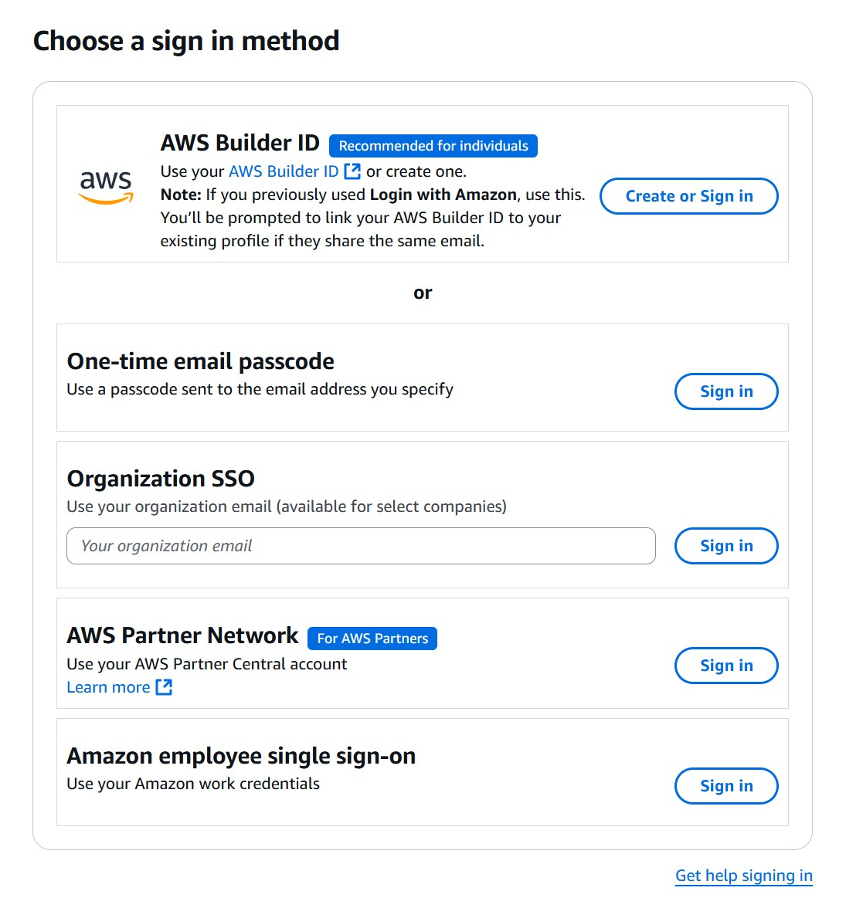

# DataLakesOct2025
## Class links
- [Access to lab and course materials](https://us-east-1.student.classrooms.aws.training/class/bsE2T5jwreefEnZX1TSNEh): when you open this link, you will be prompted to signin. The preferred way is using "builder id". Problem is this tipically only works with personal emails. If you want to use your corporate account, choose One-time email password (preferred) or SSO. The SSO option eventually prevents us from working properly on the labs. Once registered, you will get an access denied error until I add you to the class. Please send me the email used to register through chat. Below is a screenshot with the options :

## Expected pre-requisites
- [Data ANalytics on AWS - Part 1](https://skillbuilder.aws/learn/UBHK3M9YGK/fundamentals-of-analytics-on-aws--part-1/6W9DN7W5JG)
- [Data ANalytics on AWS - Part 2](https://skillbuilder.aws/learn/3CYAKC9X7J/fundamentals-of-analytics-on-aws--part-2/PSWJMV61JC)
- [AWS Technical essentials](https://skillbuilder.aws/learn/K8C2FNZM6X/aws-technical-essentials/N7Q3SXQCDY)
